# Data Analyst Multi-Agent

Sistema multi-agente para análisis exploratorio y analítico de datasets
CSV mediante lenguaje natural.

El proyecto utiliza **LangGraph**, **LangChain** y **DeepSeek** para
coordinar agentes especializados capaces de inspeccionar la calidad de
un dataset, realizar análisis mediante SQL, generar visualizaciones y
construir una interpretación narrativa de los resultados.

------------------------------------------------------------------------

## 📌 Descripción

**Data Analyst Multi-Agent** permite cargar un archivo CSV y formular
preguntas en lenguaje natural sobre sus datos.

A partir de la pregunta del usuario y del dataset proporcionado, un
supervisor coordina distintos agentes especializados:

-   **Data Quality Agent**: inspecciona la estructura, calidad y
    características estadísticas del dataset.
-   **SQL Analyst**: transforma preguntas analíticas en consultas SQL y
    ejecuta dichas consultas sobre el dataset.
-   **Chart Analyst**: determina cuándo corresponde generar una
    visualización y utiliza los resultados disponibles como fuente de
    evidencia.
-   **Narrative Agent**: interpreta los resultados obtenidos y construye
    una explicación final.
-   **Supervisor**: coordina la ejecución de los agentes según las
    necesidades del análisis.

La arquitectura busca separar claramente:

> **Razonamiento y orquestación con LLM + ejecución determinista
> mediante herramientas Python.**

Esto permite que los cálculos, estadísticas, consultas y generación de
datos para gráficos sean realizados por herramientas controladas,
mientras que los agentes se encargan de interpretar el objetivo y
decidir qué herramientas utilizar.

------------------------------------------------------------------------

## 🎯 Objetivos

El proyecto tiene como objetivos principales:

1.  Permitir análisis de datasets sin requerir conocimientos avanzados
    de SQL.
2.  Utilizar lenguaje natural como interfaz para formular preguntas
    analíticas.
3.  Separar responsabilidades mediante agentes especializados.
4.  Evitar que el LLM realice manualmente cálculos que pueden ser
    ejecutados de forma determinista.
5.  Mantener un estado compartido entre los diferentes agentes mediante
    LangGraph.
6.  Generar resultados reproducibles a partir de herramientas de
    análisis.
7.  Proporcionar visualizaciones basadas en datos reales del dataset.
8.  Mantener una arquitectura modular y preparada para futuras
    extensiones.

------------------------------------------------------------------------

## ✨ Características

### 📂 Ingesta de datasets

El sistema permite trabajar con archivos CSV y contempla diferentes
configuraciones habituales:

-   `utf-8-sig`
-   `utf-8`
-   `cp1252`
-   `latin-1`
-   Separadores `,`, `;`, tabulación y `|`

La carga incluye validaciones para detectar archivos sin registros o sin
columnas.

### 🔎 Análisis de calidad y EDA

El **Data Quality Agent** dispone de herramientas deterministas para
analizar:

-   Esquema del dataset.
-   Tipos de datos.
-   Valores nulos.
-   Registros duplicados.
-   Estadísticas descriptivas numéricas.
-   Distribuciones categóricas.
-   Valores atípicos mediante IQR.
-   Correlaciones entre variables numéricas.

### 🧮 Análisis mediante SQL

El **SQL Analyst** utiliza SQLite como motor analítico sobre el dataset
cargado.

Sus responsabilidades incluyen:

-   Inspeccionar el esquema SQL.
-   Identificar columnas relevantes.
-   Interpretar la intención de la pregunta.
-   Construir consultas SQL.
-   Ejecutar consultas `SELECT` / `WITH`.
-   Validar las consultas antes de ejecutarlas.
-   Conservar los resultados en el estado compartido.

El sistema no utiliza una estructura de columnas fija.

### 📊 Visualizaciones

El **Chart Analyst** dispone de herramientas para preparar:

-   Distribuciones numéricas.
-   Distribuciones categóricas.
-   Matrices de correlación.
-   Scatter plots.
-   Gráficos de barras.
-   Gráficos de barras agrupadas.

Una decisión importante es diferenciar entre resultados SQL de una
dimensión y resultados SQL de dos dimensiones:

``` text
Una dimensión + una métrica
        ↓
Gráfico de barras
```

``` text
Dos dimensiones + una métrica
        ↓
Gráfico de barras agrupadas
```

Esto evita recalcular métricas que ya fueron obtenidas por SQL.

### 📝 Narrativa de resultados

El **Narrative Agent** recibe los resultados producidos durante el
análisis y genera una interpretación estructurada sin inventar valores
que no hayan sido producidos por las herramientas.

------------------------------------------------------------------------

## 🏗️ Arquitectura

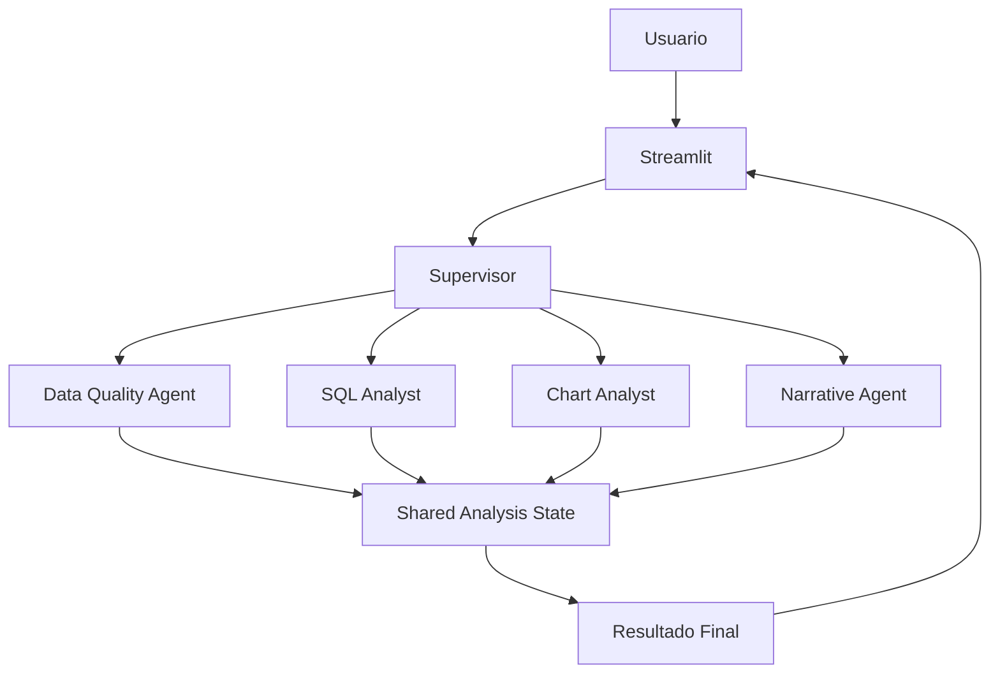

### Flujo conceptual

``` text
CSV + pregunta del usuario
          │
          ▼
      Streamlit
          │
          ▼
      Supervisor
          │
    ┌─────┼──────────────┐
    │     │              │
    ▼     ▼              ▼
 Data    SQL           Chart
Quality Analyst       Analyst
    │     │              │
    └─────┼──────────────┘
          ▼
   Narrative Agent
          │
          ▼
    Informe final
```

------------------------------------------------------------------------

## 🤖 Agentes

### Supervisor

Coordina el proceso y decide qué agente especializado debe intervenir.

Actualmente coordina:

-   `data_quality_agent`
-   `sql_analyst`
-   `chart_analyst`
-   `narrative_agent`

### Data Quality Agent

Responsable de inspección inicial y análisis exploratorio.

Herramientas:

``` text
inspect_dataset_schema
inspect_missing_values
inspect_duplicates
inspect_numeric_statistics
inspect_categorical_statistics
inspect_outliers
inspect_correlations
```

### SQL Analyst

Responsable del análisis basado en consultas SQL.

Herramientas:

``` text
inspect_sql_schema
run_sql_query
```

Trabaja con el esquema real del dataset y no depende de nombres de
columnas predeterminados.

### Chart Analyst

Responsable de determinar y preparar las visualizaciones.

Herramientas:

``` text
inspect_numeric_distribution
inspect_categorical_distribution
inspect_correlation_matrix
inspect_scatter_data
inspect_sql_result_bar
inspect_grouped_sql_result
```

Una decisión de diseño importante es diferenciar entre una dimensión y
dos dimensiones para evitar estructuras incorrectas como:

``` text
Categoria + Categoria
```

cuando el resultado real contiene:

``` text
Categoria + métrica
```

### Narrative Agent

Transforma los resultados técnicos en una explicación comprensible.

Utiliza como contexto los resultados disponibles, incluyendo información
del dataset, calidad, SQL y visualizaciones.

------------------------------------------------------------------------

## 🧠 Estado compartido

Los agentes utilizan un estado compartido definido mediante LangGraph.

Incluye información como:

``` text
dataset
dataset_name
user_question
dataset_info
dataset_schema

missing_values
duplicate_info
numeric_summary
categorical_summary
outliers
correlations

eda_charts
chart_results

sql_query
sql_results

eda_analysis
narrative
final_report

errors
```

Los resultados producidos por los agentes especializados se incorporan
al estado y pueden ser utilizados posteriormente por otros agentes.

------------------------------------------------------------------------

## 🧰 Tecnologías

### Lenguaje

-   Python 3.13

### Frameworks y librerías

-   [LangChain](https://www.langchain.com/)
-   [LangGraph](https://www.langchain.com/langgraph)
-   [Streamlit](https://streamlit.io/)
-   [Pandas](https://pandas.pydata.org/)
-   [Plotly](https://plotly.com/python/)
-   [python-dotenv](https://pypi.org/project/python-dotenv/)
-   [langchain-deepseek](https://pypi.org/project/langchain-deepseek/)
-   Pytest

### Modelo de lenguaje

El proyecto utiliza DeepSeek mediante `ChatDeepSeek`.

La configuración del modelo se realiza mediante variables de entorno.

------------------------------------------------------------------------

## 📁 Estructura del proyecto

``` text
data-analyst-multiagent/
│
├── app/
│   ├── __init__.py
│   ├── main.py
│   ├── config.py
│   │
│   ├── agents/
│   │   ├── __init__.py
│   │   ├── data_quality.py
│   │   ├── sql_analyst.py
│   │   ├── chart_analyst.py
│   │   ├── narrative.py
│   │   ├── registry.py
│   │   └── supervisor.py
│   │
│   ├── graph/
│   │   ├── __init__.py
│   │   ├── state.py
│   │   └── workflow.py
│   │
│   ├── prompts/
│   │   ├── __init__.py
│   │   └── prompts.py
│   │
│   ├── services/
│   │   ├── __init__.py
│   │   ├── dataset.py
│   │   ├── llm.py
│   │   └── visualization.py
│   │
│   └── tools/
│       ├── __init__.py
│       ├── data_tools.py
│       ├── sql_tools.py
│       ├── chart_tools.py
│       └── agent_tools.py
│
├── tests/
├── assets/                 # Capturas de pantalla y recursos visuales
├── data/
├── outputs/
├── .env
├── .env.example
├── .gitignore
├── requirements.txt
└── README.md
```

------------------------------------------------------------------------

## ⚙️ Requisitos

-   Python 3.13
-   Git
-   Entorno virtual de Python
-   API Key de DeepSeek

------------------------------------------------------------------------

## 🚀 Instalación

### 1. Clonar el repositorio

``` bash
git clone https://github.com/solanomillo/data-analyst-multiagent.git
cd data-analyst-multiagent
```

### 2. Crear el entorno virtual

``` bash
python -m venv .venv
```

### 3. Activar el entorno virtual

Git Bash:

``` bash
source .venv/Scripts/activate
```

PowerShell:

``` powershell
.venv\Scripts\Activate.ps1
```

### 4. Instalar dependencias

``` bash
pip install -r requirements.txt
```

------------------------------------------------------------------------

## 🔐 Configuración

Crear un archivo `.env` en la raíz:

``` env
APP_NAME=Data Analyst Multi-Agent
APP_VERSION=0.1.0

DEEPSEEK_API_KEY=tu_api_key
DEEPSEEK_MODEL=deepseek-flash
```

  Variable             Descripción               Valor predeterminado
  -------------------- ------------------------- ----------------------------
  `APP_NAME`           Nombre de la aplicación   `Data Analyst Multi-Agent`
  `APP_VERSION`        Versión                   `0.1.0`
  `DEEPSEEK_API_KEY`   API Key de DeepSeek       Requerida
  `DEEPSEEK_MODEL`     Modelo de DeepSeek        `deepseek-flash`

> Nunca subir `.env` al repositorio.

------------------------------------------------------------------------

## ▶️ Ejecución

Con el entorno virtual activado:

``` bash
streamlit run app/main.py
```

Streamlit mostrará la URL local de la aplicación.

------------------------------------------------------------------------

## 📊 Ejemplo de uso

Después de cargar un CSV, el usuario puede formular preguntas en
lenguaje natural:

``` text
¿Cuál es el salario promedio por departamento?
```

Flujo conceptual:

``` text
Pregunta
   ↓
Supervisor
   ↓
Data Quality
   ↓
SQL Analyst
   ↓
Chart Analyst
   ↓
Narrative
   ↓
Resultado
```

Otro ejemplo:

``` text
¿Cuál es el consumo promedio por tipo de vivienda y zona?
```

El SQL Analyst puede producir:

``` text
Tipo_Vivienda
Zona
consumo_promedio_kWh
```

El Chart Analyst utiliza ese resultado para construir un gráfico de
barras agrupadas sin volver a calcular la métrica.

------------------------------------------------------------------------

## 🔄 Flujo de análisis

1.  **Carga:** el usuario proporciona un CSV.
2.  **Interpretación:** se identifica la intención analítica.
3.  **Calidad:** Data Quality inspecciona el dataset.
4.  **Análisis:** intervienen SQL Analyst y/o Chart Analyst según
    corresponda.
5.  **Integración:** los resultados se almacenan en el estado
    compartido.
6.  **Narrativa:** Narrative Agent interpreta la evidencia.
7.  **Presentación:** Streamlit muestra resultados y visualizaciones.

------------------------------------------------------------------------

## 🧪 Testing

Ejecutar toda la suite:

``` bash
pytest -q
```

Estado validado de la versión actual:

``` text
108 passed in 35.27s
```

Las pruebas cubren:

-   Ingesta de datasets.
-   Herramientas de análisis.
-   Calidad de datos.
-   SQL.
-   Visualizaciones.
-   Integración entre agentes.
-   Supervisor.
-   Flujo general.

------------------------------------------------------------------------

## 🛡️ Principios de diseño

### Separación de responsabilidades

``` text
Supervisor      → Orquestación
Data Quality    → Calidad y EDA
SQL Analyst     → Consultas analíticas
Chart Analyst   → Visualización
Narrative       → Interpretación
```

### Herramientas deterministas

Los cálculos se realizan mediante herramientas Python o SQL cuando
existe una operación determinista disponible.

### Estado compartido

Los resultados se comunican mediante el estado de LangGraph y no
mediante variables globales.

### Adaptación al dataset

No se presupone una estructura fija de columnas. El sistema trabaja con
el esquema real del CSV.

### Evidencia antes que generación

Los agentes utilizan los resultados de las herramientas como fuente de
información y no deben inventar columnas, métricas, valores o
resultados.

------------------------------------------------------------------------

## 🔒 Seguridad y buenas prácticas

-   Las credenciales se mantienen mediante variables de entorno.
-   `.env` no debe subirse al repositorio.
-   Las consultas SQL son validadas antes de ejecutarse.
-   Los valores del dataset deben tratarse como datos, no como
    instrucciones.
-   La aplicación separa agentes, herramientas, servicios, prompts,
    configuración y tests.

------------------------------------------------------------------------

## 📈 Estado actual

-   [x] Carga robusta de CSV.
-   [x] Detección de codificación.
-   [x] Detección de separadores.
-   [x] Análisis de calidad.
-   [x] Estadísticas descriptivas.
-   [x] Detección de outliers.
-   [x] Correlaciones.
-   [x] Análisis SQL.
-   [x] Validación de SQL.
-   [x] Visualizaciones.
-   [x] Gráficos de barras.
-   [x] Gráficos de barras agrupadas.
-   [x] Integración SQL → visualización.
-   [x] Agentes especializados.
-   [x] Supervisor.
-   [x] Estado compartido con LangGraph.
-   [x] Narrative Agent.
-   [x] Suite automatizada.
-   [x] 108 tests pasando.

------------------------------------------------------------------------

## 🗺️ Evolución prevista

La arquitectura permite incorporar nuevas capacidades sin modificar las
responsabilidades principales.

Posibles líneas de evolución:

-   Nuevos tipos de visualización.
-   Nuevas herramientas analíticas.
-   Mayor cobertura de datasets.
-   Persistencia de sesiones.
-   Mejoras de interfaz.
-   Exportación de informes.
-   Nuevas fuentes de datos.
-   Observabilidad avanzada.
-   Optimización del flujo de agentes.

Estas funcionalidades son líneas de evolución y no deben considerarse
implementadas en la versión actual.

------------------------------------------------------------------------

## 🤝 Desarrollo y contribución

Las contribuciones deben mantener:

-   PEP 8.
-   Separación de responsabilidades.
-   Código modular.
-   Tipado cuando aporte claridad.
-   Docstrings en español.
-   Logging para operaciones relevantes.
-   Tests para nuevas funcionalidades.
-   DRY.
-   Prompts separados del código de ejecución.
-   Conventional Commits.

Ejemplos:

``` text
feat: add new chart analysis tool
fix: correct sql result visualization
test: improve chart tool coverage
refactor: simplify agent state handling
docs: update project documentation
```

---

## 📸 Capturas de pantalla

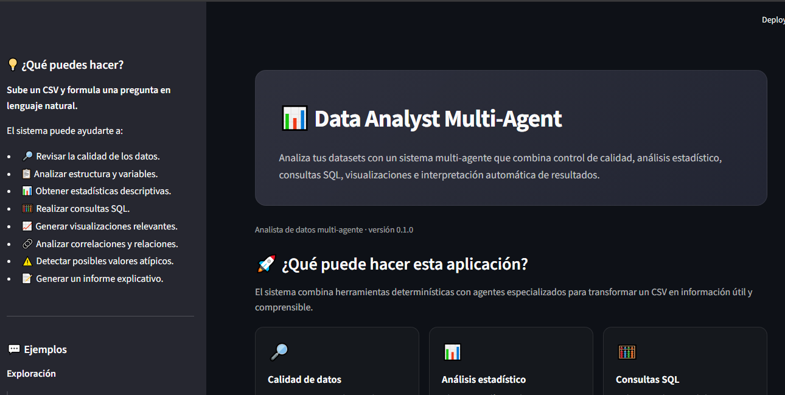
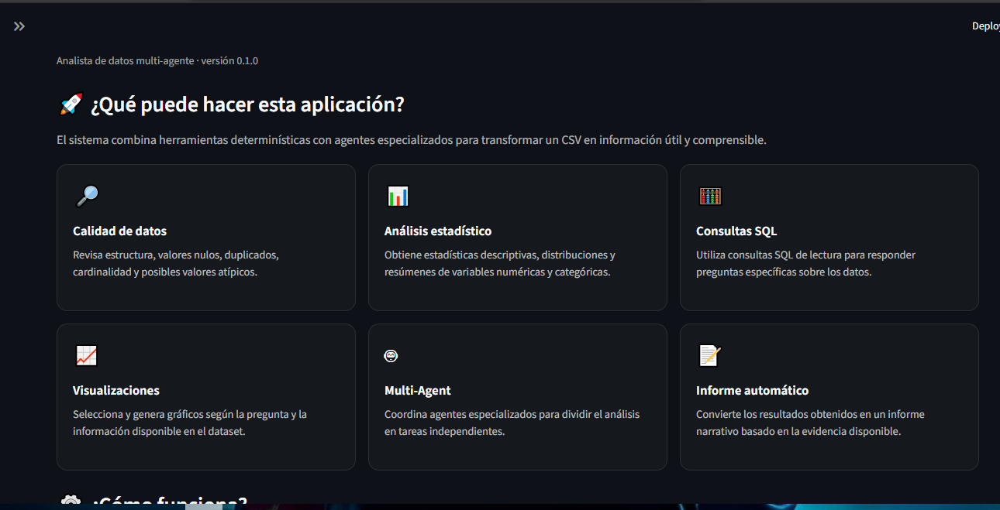
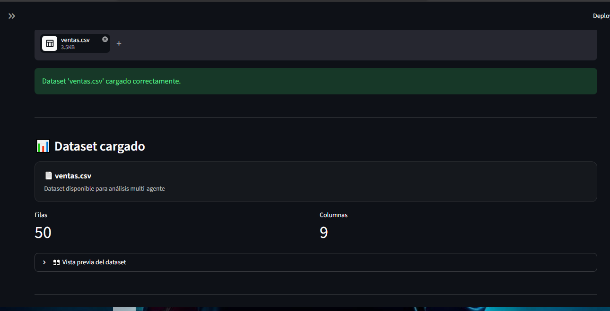
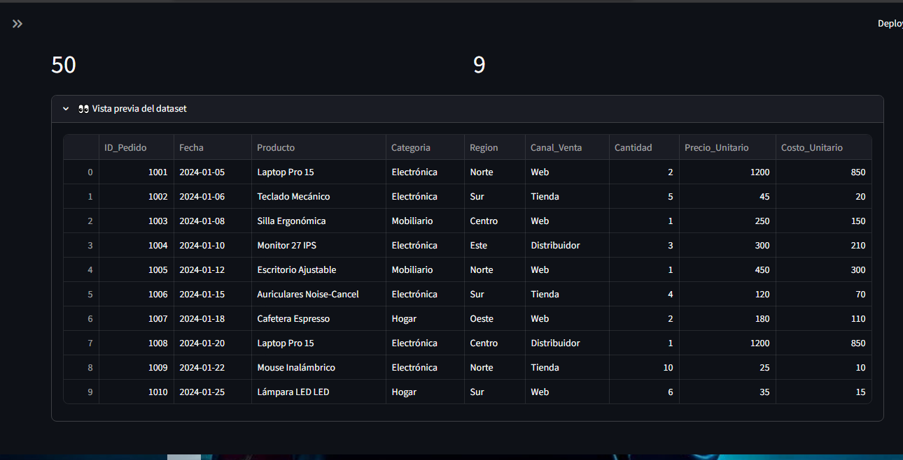
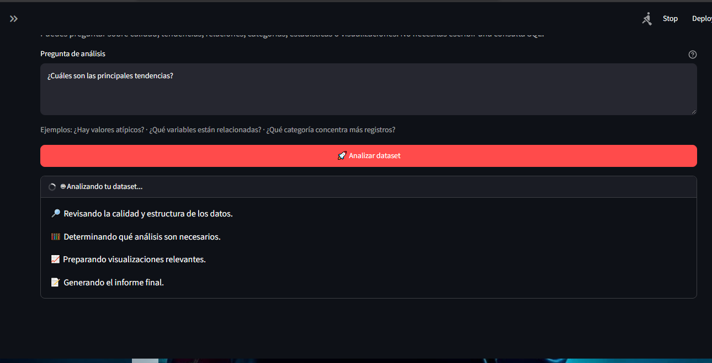
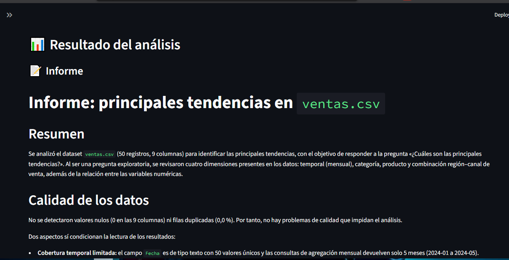
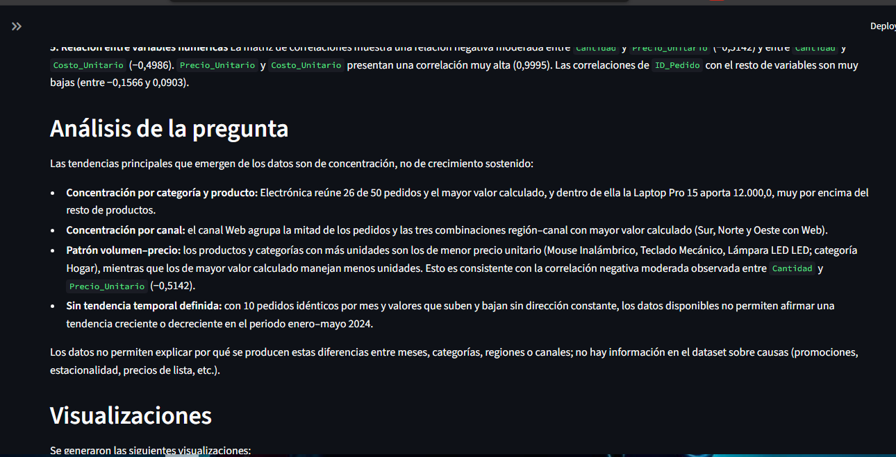
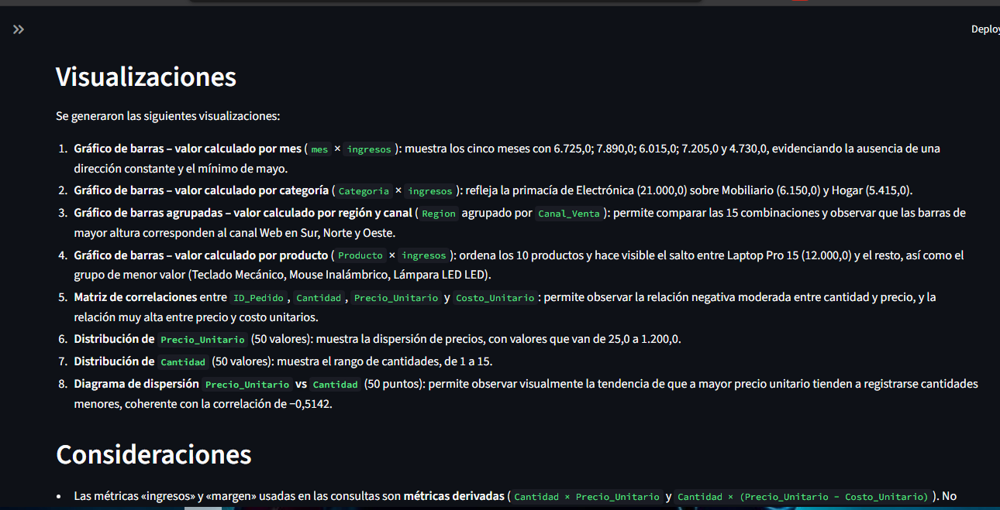
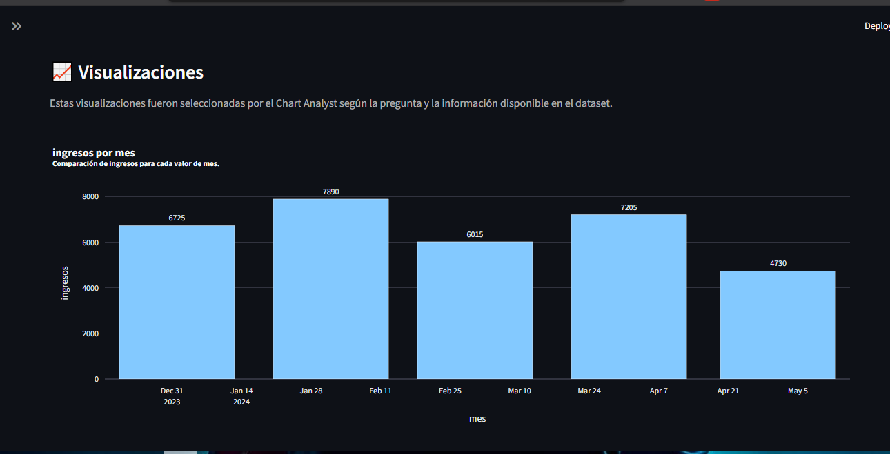
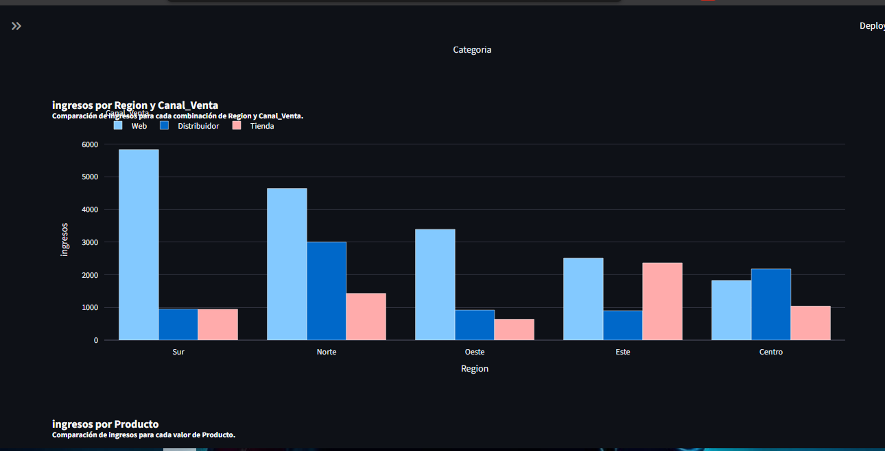
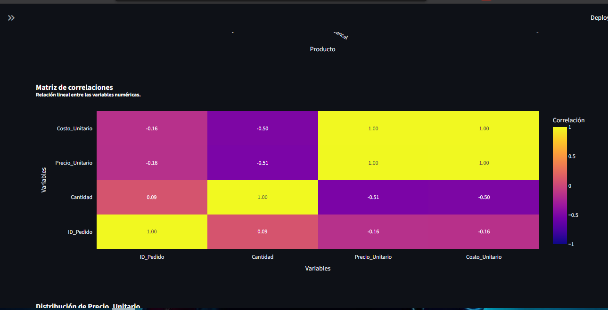
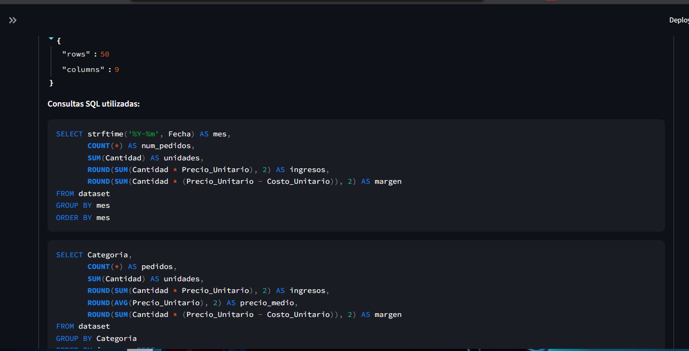

---

## 👨‍💻 Autor

**Julio Solano**

- 🔗 GitHub: [github.com/solanomillo](https://github.com/solanomillo)
- 🔗 LinkedIn: [linkedin.com/in/julio-cesar-solano](https://www.linkedin.com/in/julio-cesar-solano)
- 📧 Email: [solanomillo144@gmail.com](mailto:solanomillo144@gmail.com)

---

## 📝 Licencia

Este proyecto está bajo la **Licencia MIT**. Para más detalles, consulta el archivo [`LICENSE`](https://github.com/solanomillo/data-analyst-multiagent/blob/main/LICENSE) del repositorio.

Copyright © 2026 [Julio Cesar Solano](https://github.com/solanomillo/) - Backend Developer.

---

## ⭐ Data Analyst Multi-Agent

Un sistema orientado a convertir preguntas en lenguaje natural sobre
datasets en análisis reproducibles mediante agentes especializados,
herramientas deterministas y un flujo coordinado con LangGraph.
